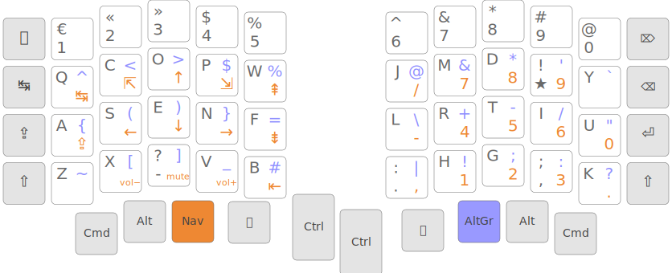

# sofle-config

QMK keymap for the Sofle RGB split keyboard, built around the [Ergo-L](https://ergol.org) layout.


*Layout image from [ergol.org](https://ergol.org/claviers/compacts/#kbd_4x6)*

## Features

- **Left OLED** — layout name, active layer, caps lock state, WPM
- **Right OLED** — WPM-reactive neko cat animation (sleeps → sits → walks → runs)
- **RGB** — purple reactive bloom on keypress, fades to black
- **Left encoder** — volume (1% steps)
- **Right encoder** — scroll (mouse wheel) / click = play-pause
- **NavNum layer** — official Ergo-L navigation + numpad layout
- **FN layer** — F-keys, media controls, QK_BOOT

## Layout

Base layer is QWERTY — Ergo-L is handled at OS level via [kalamine](https://github.com/nicowillis/kalamine).

Thumb row:

```
[ Cmd ][ Alt ][ Nav ][ Spc ][ Ctrl ]    [ Ctrl ][ Ent ][ AltGr ][ FN ][ Cmd ]
```

NavNum layer (hold Nav):

```
Left hand                     Right hand (numpad)
Q=Tab   W=Home  E=↑  R=End  T=PgUp     /   7   8   9
A=Caps  S=←     D=↓  F=→    G=PgDn     -   4   5   6   0
        X=Vol-  C=Mute V=Vol+ B=S-Tab       1   2   3   .
```

## Installation

### Requirements

- [QMK Firmware](https://github.com/qmk/qmk_firmware)
- QMK CLI (`pip install qmk`)

### Steps

```bash
# 1. clone this repo into your QMK keymaps directory
git clone https://github.com/brayevalerien/sofle-config \
  ~/qmk_firmware/keyboards/sofle/keymaps/sofle-config

# 2. compile
qmk compile -kb sofle/rev1 -km sofle-config

# 3. flash (repeat for both halves)
qmk flash -kb sofle/rev1 -km sofle-config
```

### Volume steps (optional)

For 1% volume increments, update your Hyprland config:

```
binde = , XF86AudioRaiseVolume, exec, pamixer -i 1
binde = , XF86AudioLowerVolume, exec, pamixer -d 1
```

### Ergo-L layout switching

Bind `SUPER+K` in your compositor to cycle keyboard layouts. In Hyprland:

```
bind = $mainMod, K, exec, hyprctl switchxkblayout all next
input {
    kb_layout = fr,fr
    kb_variant = azerty,ergol
}
```
